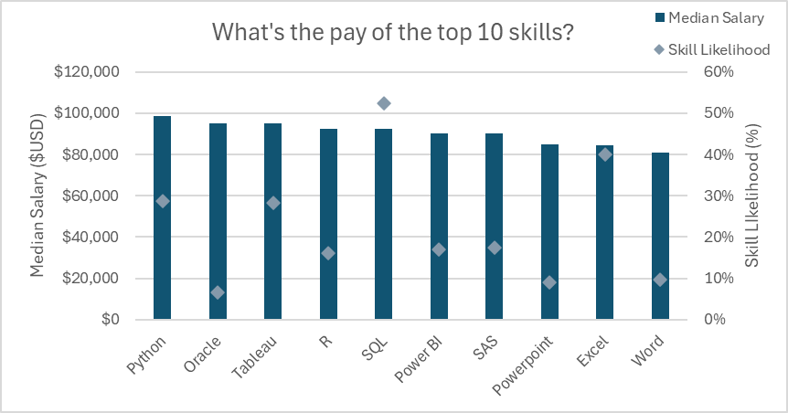

# Overview
## Welcome to my Excel Project!!!

## 📝In this session, we will explore the concepts of PivotTables and PivotCharts, examine the different types of operations they support, and gain hands-on experience with Power Query and Power Pivot to demonstrate the versatility and usefulness of these tools within Excel.

🗃️The Data Tables: sourced from Luke Barousse's Excel Course, contain various columns and rows that enable us to practice and apply Excel skills for analysis.

[Luke Barousse Excel Data Source](https://github.com/lukebarousse/Excel_Data_Analytics_Course/tree/main)


## Data Tables:
1. **data_jobs_salary_all**: Original Data Table
2. **data_jobs_salary**: All the data jobs information(Power Query Extraction from data_jobs_salary_all)
3. **data_jobs_skills**: listing the skills for each job ID (Power Query Extraction from data_jobs_salary_all)

--> Detail steps will be shown directly inside the Power Query Editor in the [Excel_Final.xlsx](Excel_Final.xlsx)
  
**Key Notes:** Make sure to change your source so it direct to the place where you download the excel file

## 🎯Basics Knowledge:
### 𝄜 PivotTable

- A PivotTable is a tool in Excel that summarizes, analyzes, and explores data.

- It lets you group, filter, and aggregate large datasets quickly.

- You can calculate sums, averages, counts, percentages, etc. without writing formulas.

- Example: From a sales dataset, you can create a PivotTable to see total sales by product and region.

### 📊PivotChart

- A PivotChart is a visual representation of a PivotTable.

- It updates automatically when the PivotTable changes.

- You can use it to see trends, comparisons, and patterns in your summarized data.

- Example: The PivotChart corresponding to the sales PivotTable could show a bar chart of sales by product category.
### 🧮Power Query (Clean & Shape Data)

- A tool in Excel for importing, cleaning, and transforming data before analysis.

- Lets you connect to different data sources, remove duplicates, split columns, filter rows, and shape the data without changing the original source.

- Think of it as Excel’s “data prep assistant”.

### 🛣️Power Pivot (Analyze & Model Data)

- A tool for creating a data model inside Excel, allowing you to analyze large datasets efficiently.

- Lets you build relationships between tables, create calculated columns and measures using DAX, and handle millions of rows.

- Think of it as Excel’s “advanced analysis engine”.

### 📚DAX (Data Analysis Expressions)

- A formula language used in Power Pivot, Power BI, and Analysis Services.

- Lets you create custom calculations, measures, and calculated columns for analyzing data.

- Example: You can write a DAX formula to calculate total sales, year-over-year growth, or running totals.<br>
<br>

# ❓Questions❓
1. What are the top skills of Data Nerds?

2. Do more skills equal more money for Data Nerds?

3. Median Salary of the US compared to the world or "your country"

4. What's the pay of the Top 10 Skills?<br>
<br>


# ✦Project Analysis✦

## 1. What are the top skills of Data Nerds?  

## 🛠️Steps:
1. **Create Relationships** from both tables of data_jobs_salary and data_jobs_skills with both of their "job_id" 
2. job_skills from the data_jobs_skills table to the **rows**, and Skill Likelihood on the **value**.  
### ➢ Skill Likelihood from Add Measure (% of how a skill is needed for the total jobs)
```
= DIVIDE([Skill Count], [Job Count])
```


### 🤔However, why should we know it?
"Grasping the most in-demand skills within the industry not only enables professionals to remain competitive but also informs training and educational initiatives to emphasize the technologies with the greatest impact."

## 2. Do more skills equal more money for Data Nerds?

### 🛠️Steps:
- job_title_short from the data_jobs_salary column to the rows
- **Add two Measure** and puth them in the value:  

➢ **Median Salary**
```
 = MEDIAN(data_jobs_salary[salary_year_avg])
```
➢ **Skills Per Jobs** (similar as Skill Liklihood)
```
= DIVIDE([Skill Count], [Job Count])
```


## 💡Analysis:
### Low-skill, lower pay jobs

- **Business Analyst**: lowest in both skills (around 3.3 skills,  ~$85K).
- **Data Analyst**: slightly higher (3.5 skills, ~$90K).

### Mid-range jobs

- **Software Engineer, Cloud Engineer, Machine Learning Engineer**: 
    - 5–6 skills required.
    - Median salaries between $95K–$105K.

- **Senior Data Analyst**: ~4.5 skills, ~$110K — fewer skills than peers but earns more due to seniority.

### High-skill, higher pay jobs

- **Data Engineer**: ~7 skills, ~$125K.
- **Senior Data Engineer**: ~8.2 skills, ~$147K — highest skills and one of the top salaries.
- **Senior Data Scientist**: ~$150K but only ~5.2 skills — shows salary isn’t purely about skills but also role seniority and specialization.

## 👨🏻‍💻Key Insights

- **Skills matter, but not alone.** There’s a trend that more skills = better pay, but the strength of the relationship isn’t absolute.

- Role seniority boosts salary. **Senior titles** (Senior Data Engineer, Senior Data Scientist) earn significantly more even with a similar or lower number of skills requested.

- **Specialization vs. generalization.** Some roles (like Data Engineer) demand a broad range of skills and pay well. Others (Senior Data Scientist) reward depth and experience rather than quantity of skills.

## 👉Answer to the Title Question:

 **Yes**, more skills generally lead to higher pay, but job role and seniority play an equally important role.
In other words, being a senior or in a specialized high-demand role can sometimes outweigh the raw number of skills required.


-----
## 3. Median Salary of the US compared to the world or "your country"
### 🔢Showcase Skills: DAX and PivotTables

## 🛠️Steps:
1. Creating a PivotTable using the data models(tables) of data_jobs_salary and data_jobs_skills  

2. Add Measures to create Median Salary of the US and non-US.  
3. Adding Slicer: job_country(from the data_jobs_salary), so you can click **"your country"** to examine how it compares to the World/US.

➢ **Median Salary of US**
```
=CALCULATE(
    MEDIAN(data_jobs_salary[salary_year_avg]),
    data_jobs_salary[job_country] = "United States")
```
➢ **Median Salary of non-US** (<> means not) 
```
=CALCULATE(
    MEDIAN(data_jobs_salary[salary_year_avg]),
    data_jobs_salary[job_country] <> "United States")
```


## 👨🏻‍💻Key Insights

- **Seniority Drives Pay**: Senior-level positions (especially in data science & engineering) earn $40k–$70k more than mid-level roles.

- **US vs Non-US Disparity**: Salaries in the US are consistently higher, with the largest pay gaps in ML and software engineering roles.

- **Best Career ROI**(Return on Investment):

    - **_Globally:_** Senior Data Scientist & Senior Data Engineer stand out as the most lucrative.

    - **_In the US:_** ML Engineer, Senior Data Engineer, and Senior Data Scientist dominate the top pay range.

    - **_Non-US:_** Senior Data Scientist and Senior Data Engineer still lead, but gaps are less extreme compared to the US.

## 🗺️ Conclusion:
The chart shows a clear hierarchy in salaries, with senior and advanced data/AI roles leading compensation globally, and a noticeable salary premium in the US—especially for Machine Learning and Software Engineering.

## 4. What's the pay of the Top 10 Skills?
### 🔢Showcase Skills: Advanced Pivot Charts(Combo Chart)

## 🛠️Steps:
1. Putting job_skills from the data_jobs_skills in the Rows
2. For the Values, we trying to obtain the median salary for the Top 10 skills and the Skill Liklihood 
3. **★Important Notes★** 
    - In the Data Model, you can only have one active relationship between two tables since it would create a circular dependency (a loop in filter flow), which leads to ambiguous results. That being said, it can't got from data_jobs_skills(using job_skills) to data_jobs_salary(Medain Salary)

4. Therefore, we had to use **"CROSSFILTER"**  
(Both ➔ for both direction)
```
= CALCULATE([Median Salary],CROSSFILTER(data_jobs_salary[job_id], data_jobs_skills[job_id],Both))
```



## ✳️Key Observations
### 1. Median Salary Trends (Bars, Left Axis)
- All the listed skills have relatively high median salaries, ranging from around $80,000 to just under $100,000 USD.

- **Highest-paying skills:**
    - Python (≈ $98,000)
    - Oracle (≈ $95,000)
    - Tableau (≈ $95,000)

- **Lowest-paying skills:**

    - Word (≈ $81,000)
    - Excel (≈ $85,000)
    - PowerPoint (≈ $86,000)

🔑 More technical/programming/data-focused skills (e.g., Python, R, SQL, Oracle, Tableau) command higher salaries than general productivity tools (Word, Excel, PowerPoint).

### 2. Skill Likelihood Trends (Diamonds, Right Axis)

- This axis shows how frequently these skills appear or are required in jobs.
- Most common skill: SQL with the highest likelihood (just over 50%).
- Other widely required skills: Excel (~40%), Python (~35–40%), Word (~10%).
- Less common skills: Oracle, PowerPoint, SAS (~10–15%).

### 3. Salary vs. Likelihood Trade-off

- **High Salary but Lower Likelihood:**

    - Oracle, Tableau, R: These have strong salary levels but aren’t as commonly required compared to SQL or Excel.

- **High Likelihood but Slightly Lower Salary:**

    - SQL, Excel: Employers frequently demand these, but their pay premiums are slightly lower than niche skills.

- **Balanced (Good Salary + High Demand):**

    - Python: Strong combination of high salary and relatively high likelihood.  

💡 This suggests that learning **Python** and **SQL** could provide both better chances of employability and strong compensation.

## 🗺️ Conclusion:
The chart highlights that **technical and analytical skills (like Python, SQL, Tableau)** provide the best career opportunities, offering a mix of high demand and high salaries. On the other hand, while office productivity skills (Excel, Word, PowerPoint) are very common, they do not differentiate professionals as much in terms of pay.